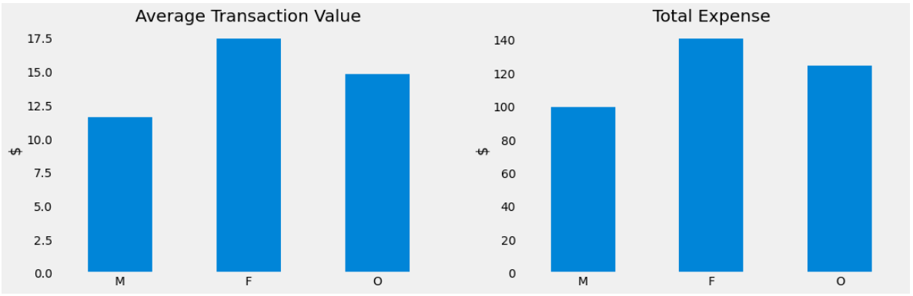
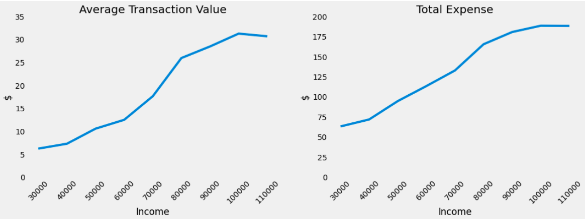
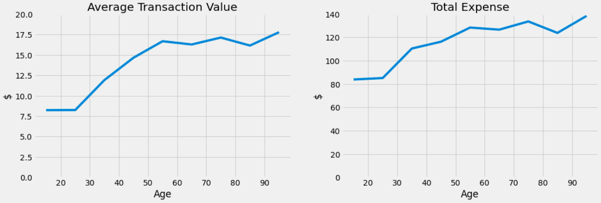
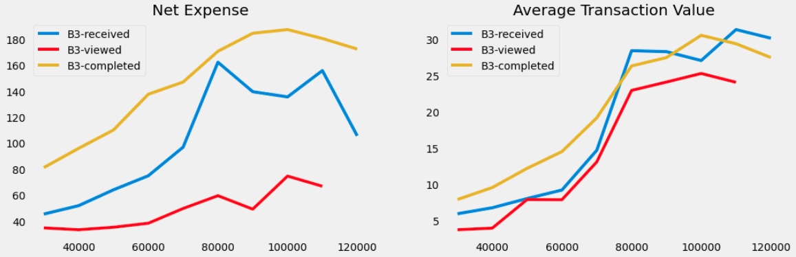
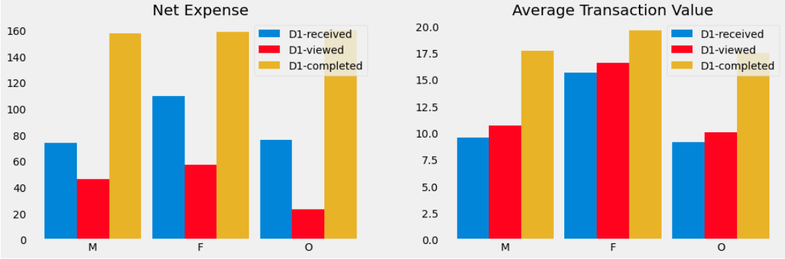

# Promotions Optimization for Starbucks
<div style="text-align:center">
  
</div>

## Project Overview

Once every few days, Starbucks sends out an offer to users of the mobile app. An offer can be merely an advertisement for a drink or an actual offer such as a discount or BOGO (buy one get one free). Some users might not receive any offer during certain weeks. A customer who received the offer would be rewarded when his/her cumulated consumption over the designed threshold. Starbucks sends different types of advertisement and offers once every few days to their customers. A customer might get one of the following:
- Informational offer (i.e., mere advertisement)
- Discount offer
- Buy one get one free (BOGO) offer  

Every offer has a validity period before the offer expires. As an example, a BOGO offer might be valid for only 5 days. We'll see in the data set that informational offers have a validity period even though these ads are merely providing information about a product; for example, if an informational offer has 7 days of validity, we can assume the customer is feeling the influence of the offer for 7 days after receiving the advertisement.

## Problem Statement

Th problem at hand is to combine transaction, demographic and offer data to determine which demographic groups respond best to which offer type. Hence this problem can be framed as a recommendation problem, where user groups are clustered based on demographics first and based on the demographics, recommendations on which offer to provide is given. This is indeed a different type of setting to traditional recommender system use-case, but nevertheless works very well in our case.

#### Metrics

Since we have defined our problem, it is vital to decide on a metric and justify the same. What would be a good metric to evaluate the performance of our recommender system? The chosen metrics are  Net Expense ```(total expense - reward recieved)```
and Average Transaction Values ```(total expense/total transactions)```. Maximizing these two metrics would result in a profit to Starbucks and will result in high customer engagement. 

#### Underlying Strategy

The strategy employed to solve this problem is as below,
1. Business Understanding of Starbucks
2. Understanding the simulatied data by Starbucks
3. Pre-process the data, extract meaningful information combining all datasets
4. Exploratory Data Analysis
5. Build Recommendation models
6. Evalute the results and iterate
7. Conclude with future improvements
8. Communicate the results

## Understanding the data

Since we have established an understanding of the business, and it's requirements, the next step is to understand the data throughly. This helps us to develop a strategy around exploratory data analysis, modeling and evalution stages.

The data is contained in three files and their schema are as below,
- portfolio.json — containing offer ids and metadata about each offer (duration, type, etc.).
  - id (string) - offer id
  - offer_type (string) - type of offer ie BOGO, discount, informational
  - difficulty (int) - minimum required spend to complete an offer
  - reward (int) - reward given for completing an offer
  - duration (int) - time for offer to be open, in days
  - channels (list of strings)
- profile.json — demographic data for each customer.
  - age (int) - age of the customer 
  - became_member_on (int) - date when customer created an app account
  - gender (str) - gender of the customer (note some entries contain 'O' for other rather than M or F)
  - id (str) - customer id
  - income (float) - customer's income
- transcript.json — records for transactions, offers received, offers viewed, and offers complete.
  - event (str) - record description (ie transaction, offer received, offer viewed, etc.)
  - person (str) - customer id
  - time (int) - time in hours since start of test. The data begins at time t=0
  - value - (dict of strings) - either an offer id or transaction amount depending on the record
  
  Upon further investigation we notice that the simulated data was obtained for a period of 29.75 days, with 306,534 events.

## Data Preparation

This is one of the tricky parts of the project, where we need to successfully combine all information after cleaning to make the most of it. Three separate helper functions have been written to clean the data and finally to merge them all.

First for the portfolio dataset we make one-hot columns for the channels, rename id as offer_id to make it easy for merging the datasets.
```
def prepare_portfolio(portfolio):
    portfolio_clean = portfolio.copy()
    d_chann = pd.get_dummies(portfolio_clean.channels.apply(pd.Series).stack(),
                             prefix="channel").sum(level=0)
    portfolio_clean = pd.concat([portfolio_clean, d_chann], axis=1, sort=False)
    portfolio_clean.drop(columns='channels', inplace=True)
    portfolio_clean.rename(columns={'id':'offer_id'}, inplace=True)

    return portfolio_clean
```
Next we pre-process the customer profile dataset. Fixing the date format, changing the id to customer_id for merging purposes and one-hot encoding are some the pre-processing steps undertaken for this dataset.
```
def prepare_profile(profile):
    profile_clean = profile.copy()
    # Transform date from int to datetime
    date = lambda x: pd.to_datetime(str(x), format='%Y%m%d')
    profile_clean.became_member_on = profile_clean.became_member_on.apply(date)
    # Create column that separates customers with valida data
    profile_clean['valid'] = (profile_clean.age != 118).astype(int)
    # Change the name of id column to customer_id
    profile_clean.rename(columns={'id':'customer_id'}, inplace=True)
    # Create dummy columns for the gender column
    dummy_gender = pd.get_dummies(profile_clean.gender, prefix="gender")
    profile_clean = pd.concat([profile_clean, dummy_gender], axis=1, sort=False)
    return profile_clean
```
Finally we take the last transactions dataset, separate values for offers and transactions, create one-hot encodings for events and change id for merging purposes.
```
def prepare_transcript(transcript):
    transcript_clean = transcript.copy()
    # Split event into several dummy columns
    transcript_clean.event = transcript_clean.event.str.replace(' ', '_')
    dummy_event = pd.get_dummies(transcript_clean.event, prefix="event")
    transcript_clean = pd.concat([transcript_clean, dummy_event], axis=1,
                                 sort=False)
    transcript_clean.drop(columns='event', inplace=True)
    # Get the offer_id data from the value column
    transcript_clean['offer_id'] = [[*v.values()][0]
                                    if [*v.keys()][0] in ['offer id',
                                                          'offer_id'] else None
                                    for v in transcript_clean.value]
    # Get the transaction amount data from the value column
    transcript_clean['amount'] = [np.round([*v.values()][0], decimals=2)
                                  if [*v.keys()][0] == 'amount' else None
                                  for v in transcript_clean.value]
    transcript_clean.drop(columns='value', inplace=True)
    # Change the name of person column to customer_id
    transcript_clean.rename(columns={'person':'customer_id'}, inplace=True)
    return transcript_clean
```
Finally we merge these dataframes together to create a single dataframe (pretty straightforward) , which we will use for all our analysis in the next stage. These steps are vital and will help us further in the project.

## Exploratory Data Analysis

EDA is one of the lengthiest process in this project. We should analyze the distribution of every variable and try to detect anomalies and outliers and treat them. Such anomalies were not present, probably because this was a simulated dataset. The in-depth visualizations of almost every variables in the dataset was carried out, and not to blow up this blog, let's leave them in the notebook which can be accessed [from here.](https://github.com/arunnthevapalan/starbucks-capstone/blob/master/Starbucks_Capstone_notebook.ipynb)

Here we would explore some interesting insights from the EDA conducted, which will directly influence our modeling phase. When separating the data based on gender, we note that the women make average purchases of $17.5, others of $15 and men of $12. However, we also note that the total amount of money spent by men and women is similar (~85,000) while others spend a fraction of that. This is distributions are directly affected by the number of members of each gender group as seen below.

<div style="text-align:center">
  
</div>

In the case of the average transaction and the total expense, we see that the values increase as the income of the customer increases, which is expected. People that make less than $30,000 have an average transaction of $6 while people making more than $90,000 have transactions of more than $25. In the case of the total expense, the values go from $60 to $180 in the same range of income and can be noted below.

<div style="text-align:center">
  
</div>

Similarly to income, as people get older, the value of their transactions and the total expense increases. This might be to the fact that there is a direct correlation between age and income as seen below.

<div style="text-align:center">
  
</div>

## Modeling

#### Knowledge based Recommendation System

Let us first build a basic recommender system which recommends the most popular offers to the customers. This is the basis of Knowledge based recommendations. Here we sort offers based on the ones that result in the highest net expense for Starbucks. This functions achieves this returning the set of best offers.
  ```
  def get_most_popular_offers(customers, n_top=2, q=0.5, offers=None):
    
    if not offers:
        offers = ['I1', 'I2', 'B1', 'B2', 'B3',
                  'B4', 'D1', 'D2', 'D3', 'D4']
    offers.sort(key=lambda x: get_net_expense(customers, x, q), reverse=True)
    offers_dict = {o: get_net_expense(customers, o, q) for o in offers}
    return offers[:n_top], offers_dict
  ```
This method assumes a correlation between offer completion and net expense, and aims at maximizing the net expense.
```
{'B2': 144.72500000000002, 'B1': 144.505, 'D1': 144.40000000000003, 'D4': 133.92000000000002, 
'B3': 127.47999999999999, 'B4': 126.145, 'D3': 125.105, 'D2': 117.8, 'I1': 109.76999999999998, 'I2': 88.41}
```

The output show us that the offer associated to customers with the highest median net expense is B1, followed by D1 and B2, the least recommended offer was I2. Note that the difference in the net expense between the best and worst offers (e.g., B1 and I2, respectively) is around $55. 

This recommendation system doesn't take into account any demographics data and adds a bias, since similar offers will always be recommended without any targeting. This leads us to **refine the models** by introducing recommendations based on demographics as the filters.

#### Knowledge-based Recommendation System with filters

Here we taken into account the demographics that we analyzed during the EDA, which as age, gender and the income levels. The idea is based on these features, we send out different offers to the customers. Let's look at the implementation below.

```
def get_most_popular_offers_filtered(customers, n_top=2, q=0.5, income=None,
                                     age=None, gender=None):
    flag = (customers.valid == 1)
    if income:
        income_gr = round_income(income)
        if income_gr > 0:
            flag = flag & (customers.income_group == income_gr)
    if age:
        age_gr = round_age(age)
        if age_gr > 0:
            flag = flag & (customers.age_group == age_gr)
    if gender:
        flag = flag & (customers.gender == gender)
    return get_most_popular_offers(customers[flag], n_top, q)
```
Now that we have set up the recommendation with filters, let us see how well our recommendation work for different genders and income levels.

## Evaluation

In reality, an A/B Test needs to be conducted to evaluate and validate the performance of the recommendations. Where one control groups received the offers based on recommendations and the other randomly. We then can measure the defined metrics, and statistically deem where there is a siginificant improvement in the added value. It is important to consider the practical significance as well, If these recommendation systems are successful we should see a significant improvement in customer/offer engagement as well as an increase in the purchase behavior of the customer. At this point, we evaluate the performance of our recommendations using visualizations of the same metrics below for some particular scenarios as seen below.

Let us have a look at the recommendations for a customer with income level $95,000 (for example), and see if the recommendations are different, and see if it is justified.

```
get_most_popular_offers_filtered(customers, n_top=10, income=95000)[1]

{'B3': 204.325, 'D3': 204.22000000000003, 'D1': 204.21, 'D4': 197.41000000000003, 
'B1': 196.62, 'D2': 195.17, 'B4': 187.98, 'B2': 186.17000000000002, 
'I1': 185.275, 'I2': 180.41500000000002}
 ```
The system picks B3 for one with an income level $95,000 which was initially B1. The graph below justifies that the net expense and the average transaction values actually approach higher in the curve, for high income levels.

<div style="text-align:center">
  
</div>

Let us validate another scenario how the recommendations differ incase of gender, when a woman is the customer, irrelavant of income levels.
```
get_most_popular_offers_filtered(customers, n_top=10, gender='F')[1]

{'D1': 154.83, 'D4': 154.62, 'B1': 153.745, 'D3': 153.59000000000003,
 'B2': 150.37, 'B4': 145.21999999999997, 'D2': 145.03000000000003,
 'I1': 142.23, 'B3': 141.60999999999999, 'I2': 132.5}
```
The recommended offer is D1, and when we look at the plot below it justifies since it clearly have higher values of net expense and average transactions. The median net expense is significantly higher when compared with the initial recommendation model.

<div style="text-align:center">
  
</div>

A final note on the approach is that recommender systems are not mutually exclusive, but can be coupled together and used. For instance when we have information regarding the customer, use the filtered recommender and use the basic recommender when we don't have much information about the customer. It's a win-win!

## Conclusion

To **relect on the complete project**, this has been a end-to-end data science problem where we start with business understanding, to communicating the results. (This blog does the cimmunicating!). In this capstone project we cleaned the datasets and created one master data with all the relavent information. We conducted a explorative data analysis and discovered different trends and correlations. With that, this project further attempts to create few recommendation systems from scratch. In reality both the models can be coupled together and used. he two recommendation systems can be used together. That is, the simple systems should be use for customers that do not provide their personal information, while the one with filters can be used for customers that do. 

It was interesting to find out the trends presents in demographic features such as age, income and gender and will be helpful for recommendations in the future for Starbucks. Hoewever **an improvement** would be incorporate complex machine learning based collaborative filtering such as FunkSVD for  considering the customer-offer interactions and arrive at a better recommendations. The completer project can be **improved** by wrapping in a flask web application, where Starbucks can query the usergroups for a particular offer and send them in a click.
